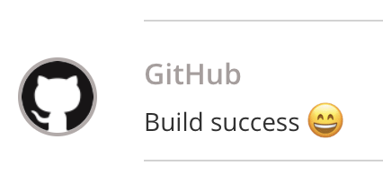

# Typetalk for GitHub Actions
Post a Typetalk message. 

## Usage
     - name: Notify to Typetalk
       uses: shomatan/typetalk-action@master
       env:
         TYPETALK_TOKEN: ${{ secrets.TYPETALK_TOKEN }}
         TOPIC_ID: 123456
       with:
         args: "Build success :smile:"

Appearance on Typetalk :

## Setup
To use this GitHub Action you'll first need to create a Typetalk Bot and configure it to the topic. And then, you set a Typetalk Token to the Secrets.

## License
MIT